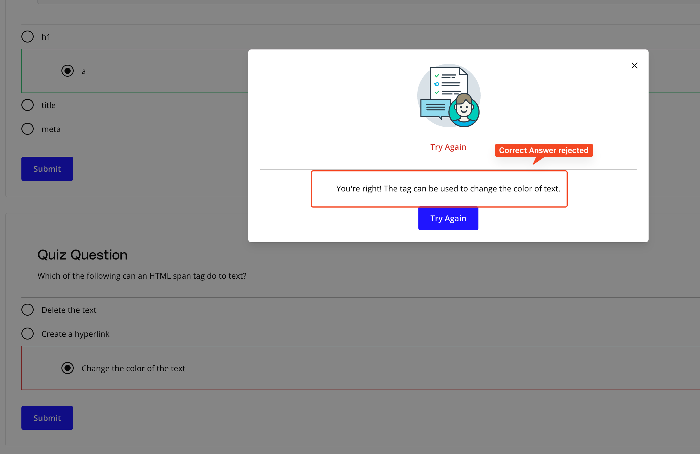

## Issue
**Issue number** _(& page link)_: 10 [`index`==10 and `Course Name`=='Advanced Data Wrangling' and `Lesson Name`=='Gathering Data' and `Page Name`=='Quizzes: HTML Files'](https://learn.udacity.com/nanodegrees/nd002/parts/cd12531/lessons/0da07272-e348-4064-995d-344d00974630/concepts/69c3de2d-6660-4373-aaf6-993ce1dbf189)
***

**The Issue:**

**Category**: Quiz is confusing

**Follow-on**: What do you find confusing?

**Commentary**: I think the span tag do changes of the text while the answer of
Question here  are delete the text so....? What would you find
helpful here? I would like to know which THE RIGHT answer the
delete text or change the color of SPAN

**Comments**: 

***
## Solution

Fixed In Mocha

</img>