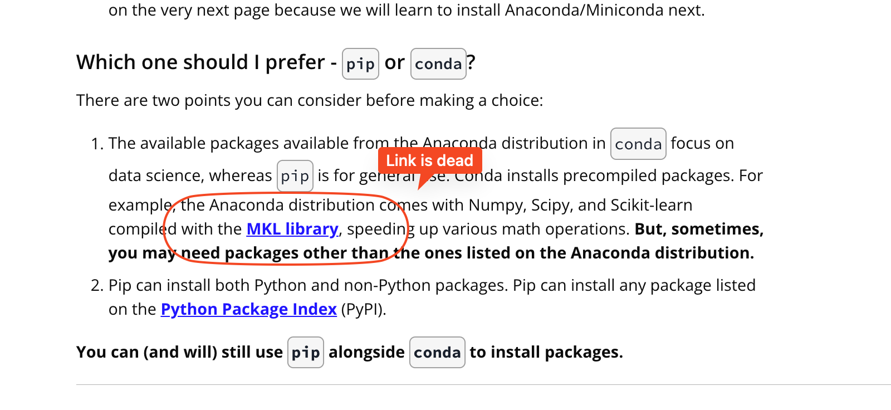

## Issue
**Issue number** _(& page link)_: 166 [`index`==166 and `Course Name`=='Introduction to Data Analysis' and `Lesson Name`=='Anaconda' and `Page Name`=='What is Anaconda?'](https://learn.udacity.com/nanodegrees/nd002-wgu-1/parts/7017d220-3f67-402c-93b0-0014bfee8bd4/lessons/a9517c3f-4536-41ad-9d8f-4a454db13352/concepts/ac4b6fd3-7a88-4da4-85ff-7cf56a586762)
***

**The Issue:**

**Category**: Error in content

**Follow-on**: What error did you encounter?

**Commentary**: MKL Library link no exist How did you know this was an error? If
you click in the MKL library, the URL return a 404 error Please
list any additional resources you reviewed.

**Comments**: 

***
## Solution

Dead link

</img>