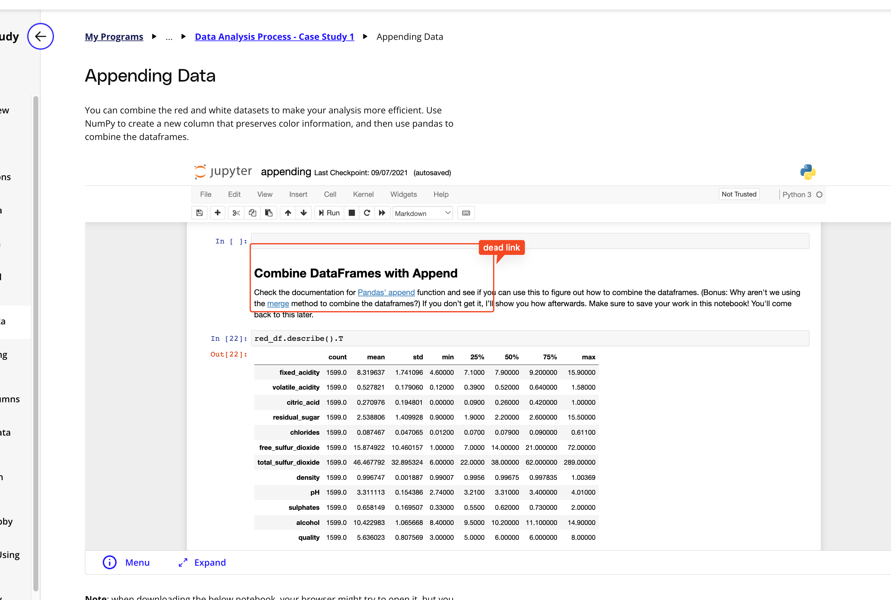

## Issue
**Issue number** _(& page link)_: 172 [`index`==172 and `Course Name`=='Introduction to Data Analysis' and `Lesson Name`=='Data Analysis Process - Case Study 1' and `Page Name`=='Appending Data'](https://learn.udacity.com/nanodegrees/nd002-wgu-1/parts/7017d220-3f67-402c-93b0-0014bfee8bd4/lessons/fbab288f-cf02-470f-98cd-d67aece8a168/concepts/6751f1a0-3cad-435b-a2c1-184415da8a8a)
***

**The Issue:**

**Category**: Error in content

**Follow-on**: What is the error?

**Commentary**: The Jupyter cell suggests using the Panda's append function,
which is now deprecated (https://pandas.pydata.org/docs/whatsnew
/v1.4.0.html#whatsnew-140-deprecations-frame-series-append).
What correction needs to be made? Change the suggestion to using
pandas concat function (https://pandas.pydata.org/docs/reference
/api/pandas.concat.html#pandas.concat)

**Comments**: 

***
## Solution

.append() has been removed from pandas .... is course being updated?

</img>