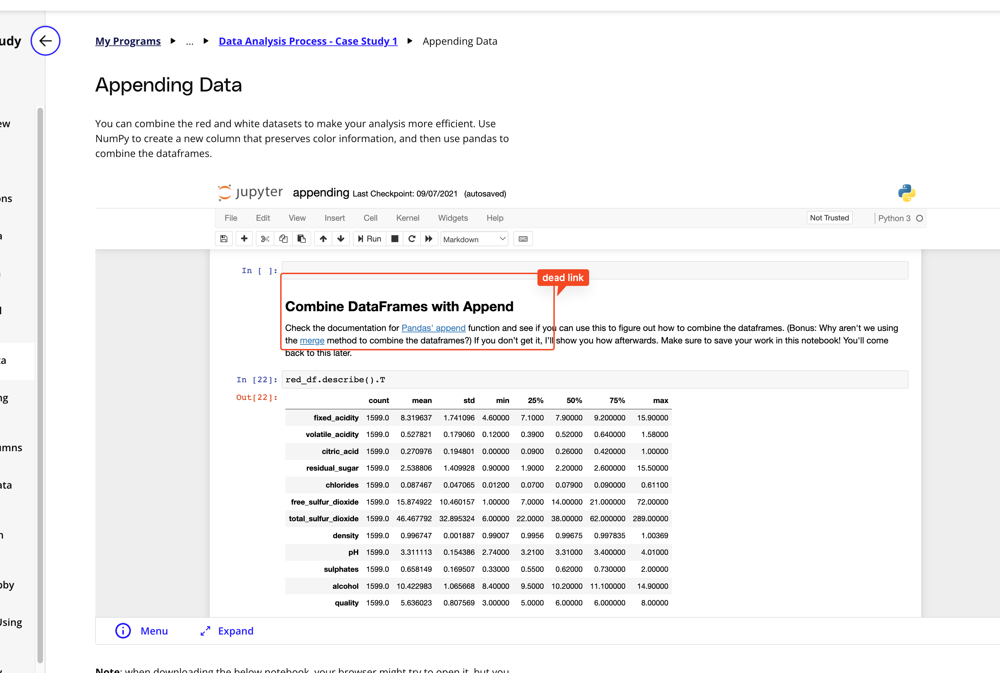

## Issue
**Issue number** _(& page link)_: 173 [`index`==173 and `Course Name`=='Introduction to Data Analysis' and `Lesson Name`=='Data Analysis Process - Case Study 1' and `Page Name`=='Appending Data'](https://learn.udacity.com/nanodegrees/nd002-wgu-1/parts/7017d220-3f67-402c-93b0-0014bfee8bd4/lessons/fbab288f-cf02-470f-98cd-d67aece8a168/concepts/6751f1a0-3cad-435b-a2c1-184415da8a8a)
***

**The Issue:**

**Category**: Loading problems

**Follow-on**: 

**Commentary**: 

**Comments**: The link for the 'Panda's append' is not working. The page goes
to an error page.

***
## Solution

.append() has been removed from pandas. Link is dead.  .... is this course being updated?

</img>