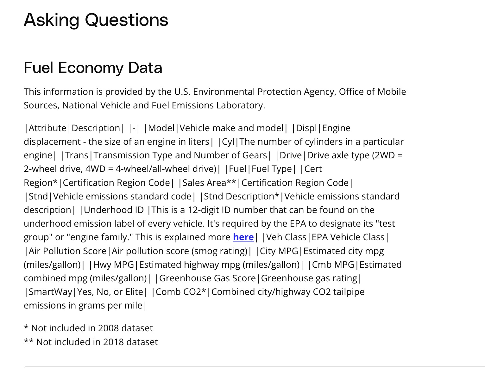

## Issue
**Issue number** _(& page link)_: 197 [`index`==197 and `Course Name`=='Introduction to Data Analysis' and `Lesson Name`=='Data Analysis Process - Case Study 2' and `Page Name`=='Asking Questions'](ADD_LINK_HERE)
***

**The Issue:**

**Category**: ntent is not explained well

**Follow-on**: What specific text is not explained well?

**Commentary**: Fuel Economy Data  What did you not understand? The content is
understandable, but the text should be displayed somehow else,
as it is very hard to read.

**Comments**: 

***
## Solution

Markdown text is not formatted

</img>