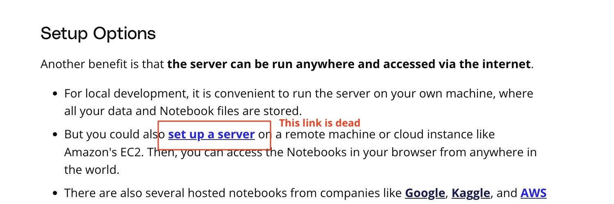

## Issue
**Issue number** _(& page link)_: 253 [`index`==253 and `Course Name`=='Introduction to Data Analysis' and `Lesson Name`=='Jupyter Notebooks' and `Page Name`=='What are Jupyter notebooks?'](https://learn.udacity.com/nanodegrees/nd002/parts/cd12529/lessons/d0712a60-6df1-403d-8ab0-7ab1590dcbd8/concepts/8fd55a01-5300-4714-998f-226140dc3d7f)
***

**The Issue:**

**Category**: ntent contains outdated information

**Follow-on**: Which specific piece of text on this page is out-of-date?

**Commentary**: some links does not work at all What text would you replace this
with? Include any links that will be helpful. update the links

**Comments**: 

***
## Solution

One of the links is dead:

</img>