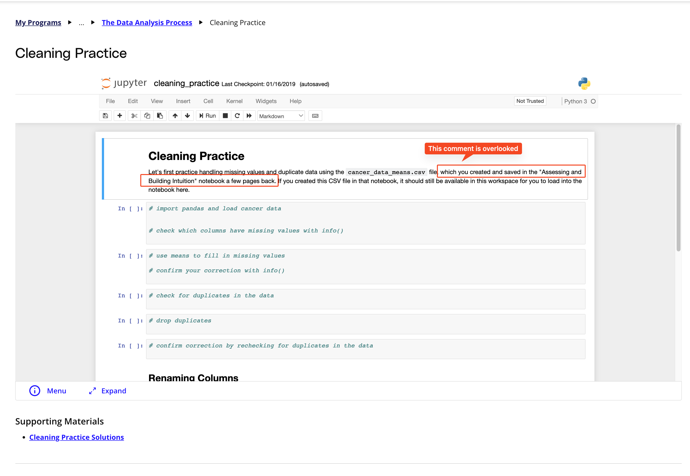
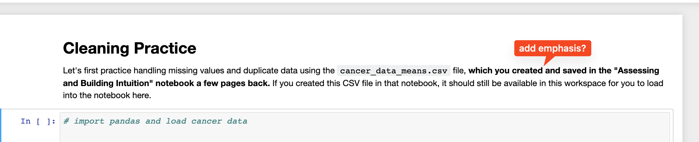

## Issue
**Issue number** _(& page link)_: 258 [`index`==258 and `Course Name`=='Introduction to Data Analysis' and `Lesson Name`=='The Data Analysis Process' and `Page Name`=='Cleaning Practice'](https://learn.udacity.com/nanodegrees/nd002-wgu-1/parts/7017d220-3f67-402c-93b0-0014bfee8bd4/lessons/b7ff86ac-c0d3-4b14-b520-7b935ab5683f/concepts/d0c03c93-50d2-4e18-a1a9-c016f5a85d75)
***

**The Issue:**

**Category**: Files missing

**Follow-on**: What is missing?

**Commentary**: FileNotFoundError: File b'cancer_data_means.csv' does not exis

**Comments**: 

***
## Solution

This file is created in a previous notebook. Add emphasis to the comment highlighting this:

- </img>
- </img>