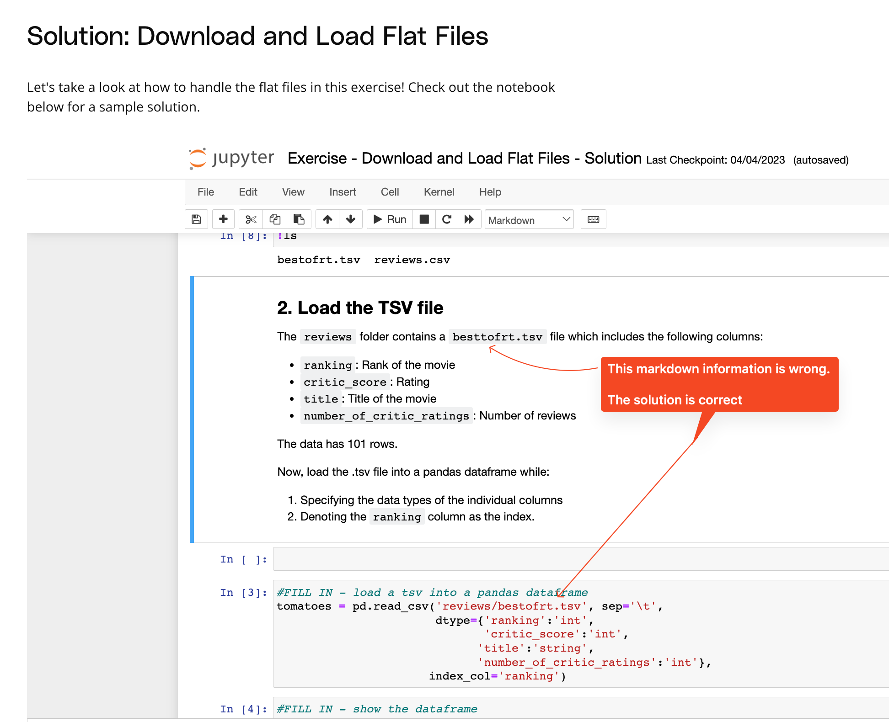

## Issue
**Issue number** _(& page link)_: 26 [`index`==26 and `Course Name`=='Advanced Data Wrangling' and `Lesson Name`=='Gathering Data' and `Page Name`=='Solution: Download and Load Flat Files'](https://learn.udacity.com/nanodegrees/nd002/parts/cd12531/lessons/0da07272-e348-4064-995d-344d00974630/concepts/b7264700-6744-4457-a80e-5d1fde3bac0a)
***

**The Issue:**

**Category**: Error in content

**Follow-on**: What is the error?

**Commentary**: You say the folder contains a "besttofrt.tsv" file, but it is
"bestofrt". You have an extra t in there which causes an error
What correction needs to be made? fix file nam

**Comments**: 

***
## Solution

The markdown text refers to "besttofrt.tsv", which should be "bestofrt.tsv" **(The solution code is correct)**.

</img>