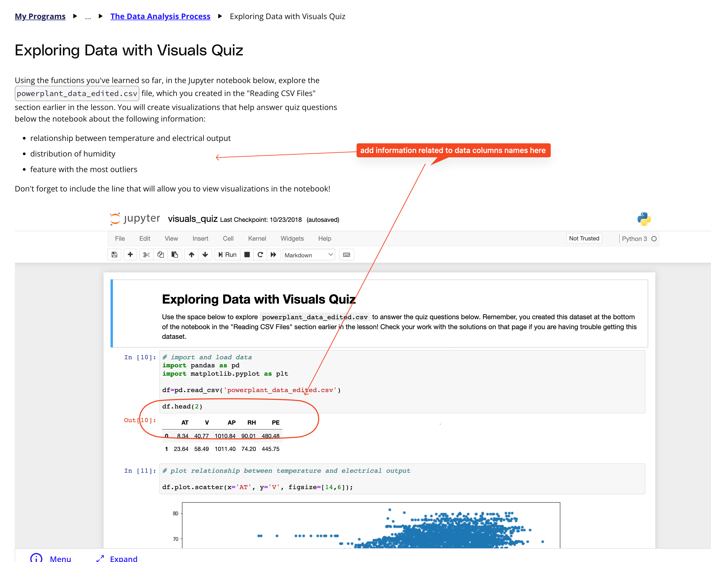

## Issue
**Issue number** _(& page link)_: 274 [`index`==274 and `Course Name`=='Introduction to Data Analysis' and `Lesson Name`=='The Data Analysis Process' and `Page Name`=='Exploring Data with Visuals Quiz'](https://learn.udacity.com/nanodegrees/nd002-wgu-1/parts/7017d220-3f67-402c-93b0-0014bfee8bd4/lessons/b7ff86ac-c0d3-4b14-b520-7b935ab5683f/concepts/a30e22f0-ddba-4e52-a709-731b1c5bcf43)
***

**The Issue:**

**Category**: Resource is missing or broken (link, dataset, etc)

**Follow-on**: What is missing or broken?

**Commentary**: There should be a link here so we can check again what the
different variables mean instead of having to dig back and
figure ou

**Comments**: 

***
## Solution

Column names for data are not meaningful - add information explaining those columns

</img>