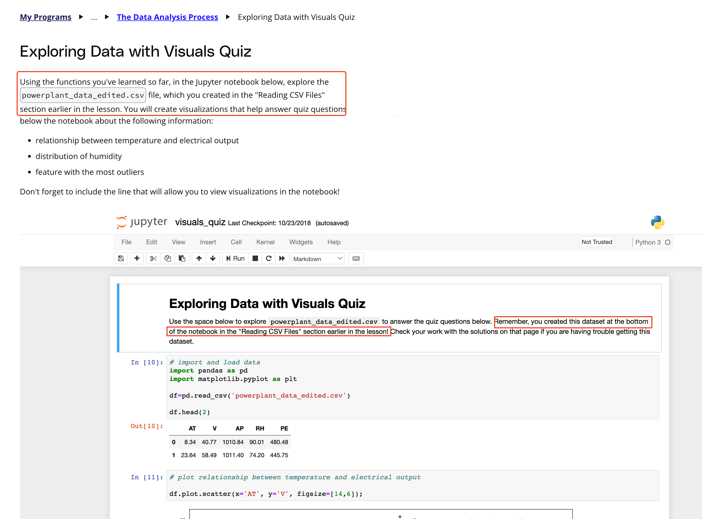

## Issue
**Issue number** _(& page link)_: 276 [`index`==276 and `Course Name`=='Introduction to Data Analysis' and `Lesson Name`=='The Data Analysis Process' and `Page Name`=='Exploring Data with Visuals Quiz'](https://learn.udacity.com/nanodegrees/nd002-wgu-1/parts/7017d220-3f67-402c-93b0-0014bfee8bd4/lessons/b7ff86ac-c0d3-4b14-b520-7b935ab5683f/concepts/a30e22f0-ddba-4e52-a709-731b1c5bcf43)
***

**The Issue:**

**Category**: Error in content

**Follow-on**: What is the error?

**Commentary**: I imported the csv 'powerplant_data_edited.csv' to the
dataframe:  df_pp = pd.read_csv('powerplant_data_edited.csv')
print(df_pp) But it shows different values: DI   Nome     3
4     5      6     7     8     9 0  27604    Joe  0.96  0.97
87.0   98.0  92.0  93.0  95.0 1  30572   Alex  1.00  0.84  92.0
89.0  94.0  92.0  91.0 2  39203  Avery  0.84  0.74  68.0   70.0
84.0  90.0  82.0 3  28592   Kris  0.96  1.00  82.0   94.0  90.0
81.0  84.0 4  27492   Rick  0.32  0.85  98.0  100.0  73.0  8
What correction needs to be made? How can I see the values from
'powerplant_data_edited.csv'?

**Comments**: This issue occures all the time. I cleared my cache which didn't
help. I am using Google Chrome browser. Please help me,
otherwise I cannot answer the questions.

***
## Solution

This issue is due to students not reading the first few lines of the page. So it is really not an actionable issue, but it given that it occurs repeatedly, using markdown to put emphais on those first few lines should help.

</img>