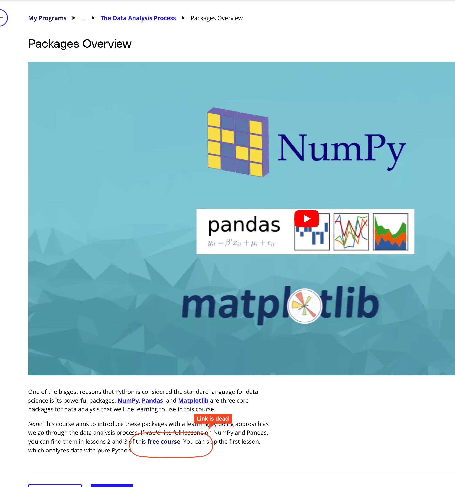

## Issue
**Issue number** _(& page link)_: 291 [`index`==291 and `Course Name`=='Introduction to Data Analysis' and `Lesson Name`=='The Data Analysis Process' and `Page Name`=='Packages Overview'](https://learn.udacity.com/nanodegrees/nd002-wgu-1/parts/7017d220-3f67-402c-93b0-0014bfee8bd4/lessons/b7ff86ac-c0d3-4b14-b520-7b935ab5683f/concepts/08e4309f-2483-4bb9-ae0e-a73ea1e90616)
***

**The Issue:**

**Category**: Resource is missing or broken (link, dataset, etc)

**Follow-on**: What is missing or broken?

**Commentary**: The link for Free course does not take you directly to the
course p

**Comments**: 

***
## Solution

dead link

</img>