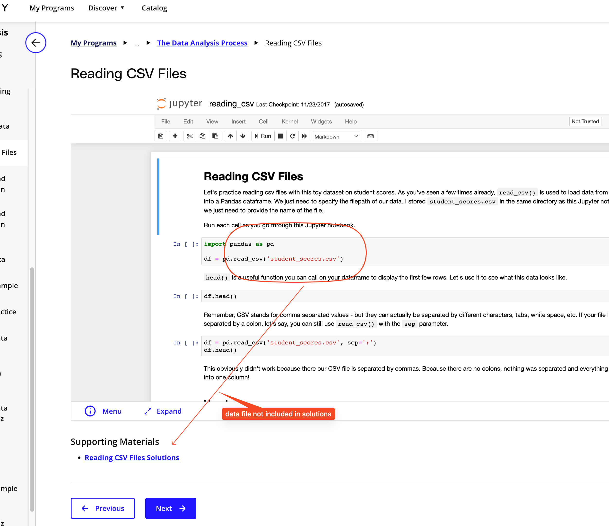

## Issue
**Issue number** _(& page link)_: 296 [`index`==296 and `Course Name`=='Introduction to Data Analysis' and `Lesson Name`=='The Data Analysis Process' and `Page Name`=='Reading CSV Files'](https://learn.udacity.com/nanodegrees/nd002-wgu-1/parts/7017d220-3f67-402c-93b0-0014bfee8bd4/lessons/b7ff86ac-c0d3-4b14-b520-7b935ab5683f/concepts/40544be2-91ce-4fa4-9dab-2fd63bd73c8f)
***

**The Issue:**

**Category**: Files missing

**Follow-on**: What is missing?

**Commentary**: HOW CAN I DOWNLOAD student_scores.csv ??

**Comments**: 

***
## Solution

Include data file in the zip file?

</img>