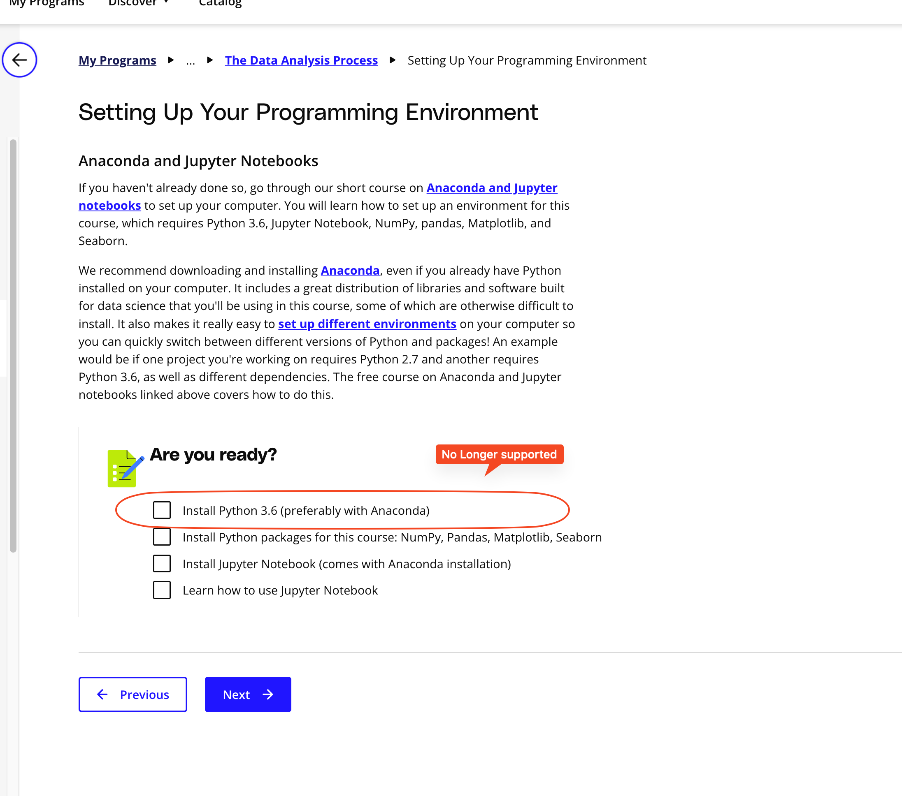

## Issue
**Issue number** _(& page link)_: 297 [`index`==297 and `Course Name`=='Introduction to Data Analysis' and `Lesson Name`=='The Data Analysis Process' and `Page Name`=='Setting Up Your Programming Environment'](https://learn.udacity.com/nanodegrees/nd002-wgu-1/parts/7017d220-3f67-402c-93b0-0014bfee8bd4/lessons/b7ff86ac-c0d3-4b14-b520-7b935ab5683f/concepts/665873f2-b940-4bdc-a119-e0b3e49f52fd)
***

**The Issue:**

**Category**: ntent contains outdated information

**Follow-on**: Which specific piece of text on this page is out-of-date?

**Commentary**: Python 3.6 is no longer supported according to the python
website, so it can't be downloaded What text would you replace
this with? Include any links that will be helpful. A new version
of python needs to be identified and included h

**Comments**: 

***
## Solution

Update notebook and text?

</img>