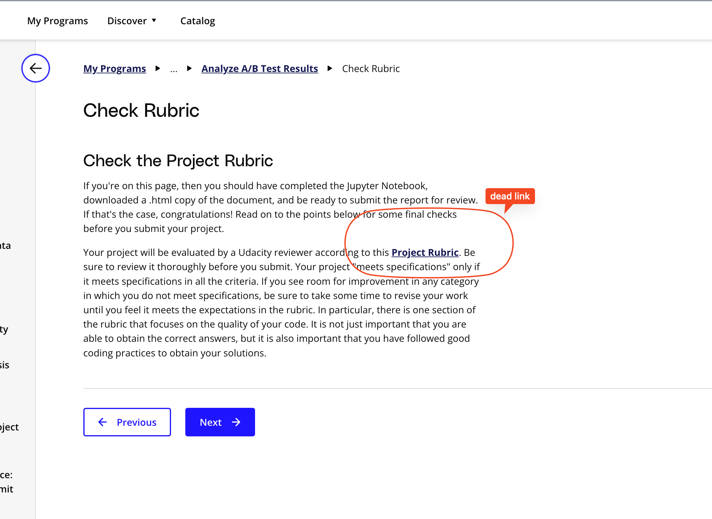

## Issue
**Issue number** _(& page link)_: 318 [`index`==318 and `Course Name`=='Practical Statistics' and `Lesson Name`=='Analyze A/B Test Results' and `Page Name`=='Check Rubric'](https://learn.udacity.com/nanodegrees/nd002-wgu-1/parts/abad44b7-04eb-4722-aaa2-0cbd94da7e80/lessons/e81073bc-19b8-4ad6-8a2f-ed21d0db103f/concepts/d01593a1-2818-459f-b0ac-7a2544d5fc25)
***

**The Issue:**

**Category**: Otro

**Follow-on**: Can you tell us more?

**Commentary**: 

**Comments**: I can't make new revisions

***
## Solution

dead link to rubric

should be: https://learn.udacity.com/nanodegrees/nd002-wgu-1/parts/abad44b7-04eb-4722-aaa2-0cbd94da7e80/lessons/e81073bc-19b8-4ad6-8a2f-ed21d0db103f/concepts/e81073bc-19b8-4ad6-8a2f-ed21d0db103f-project-rubric

</img>