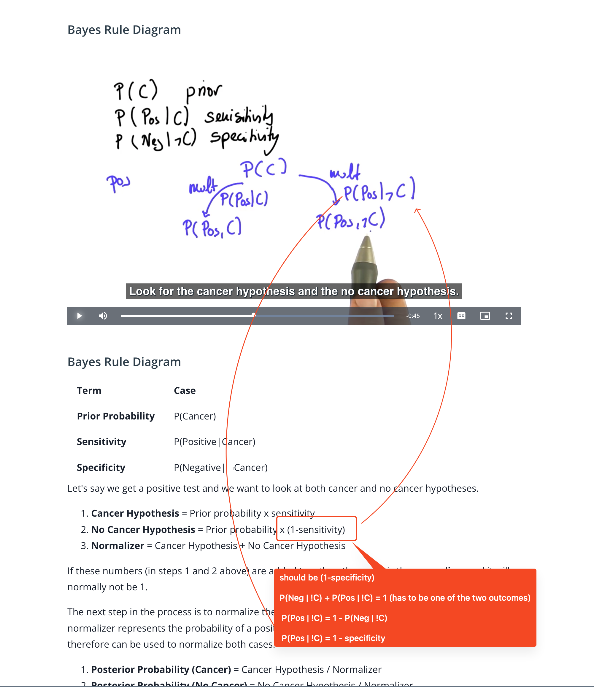

## Issue
**Issue number** _(& page link)_: 342 [`index`==342 and `Course Name`=='Practical Statistics' and `Lesson Name`=='Bayes Rule' and `Page Name`=='Bayes Rule Diagram'](https://mocha.udacity.com/programs/nd496-mentors-sandbox/en-us/construction/courses/545f4c46-ae54-4164-897e-4a0bb573302d/lessons/ls12047/pages/b72f80cf-0826-4392-bd41-31a62c8a18b8)
***

**The Issue:**

**Category**: Error in content

**Follow-on**: What error did you encounter?

**Commentary**: No Cancer Hypothesis = Prior probability x (1-sensitivity) How
did you know this was an error? Shouldn't it be the following?
No Cancer Hypothesis = Prior probability x (1-specificity)
Please list any additional resources you reviewed.

**Comments**: 

***
## Solution

correct, should be (1-specificity)

</img>