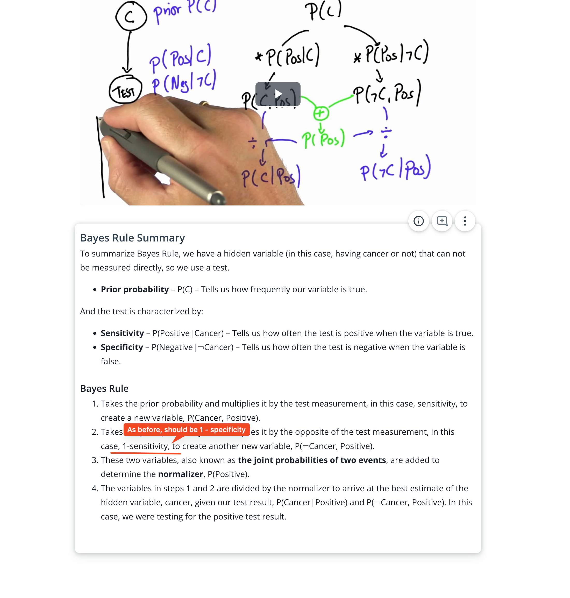

## Issue
**Issue number** _(& page link)_: 344 [`index`==344 and `Course Name`=='Practical Statistics' and `Lesson Name`=='Bayes Rule' and `Page Name`=='Bayes Rule Summary'](https://mocha.udacity.com/programs/nd496-mentors-sandbox/en-us/construction/courses/545f4c46-ae54-4164-897e-4a0bb573302d/lessons/ls12047/pages/f1876706-05f8-4f2b-abef-b0e643473050)
***

**The Issue:**

**Category**: Error in content

**Follow-on**: What error did you encounter?

**Commentary**: Reference made to 1-sensitivity instead of 1-specitivity.
Occurred in other pages as well. How did you know this was an
error? It differs from correct understanding and what was
explained in the video. Please list any additional resources you
reviewed.

**Comments**: 

***
## Solution

correct, should be 1 - specificity

</img>