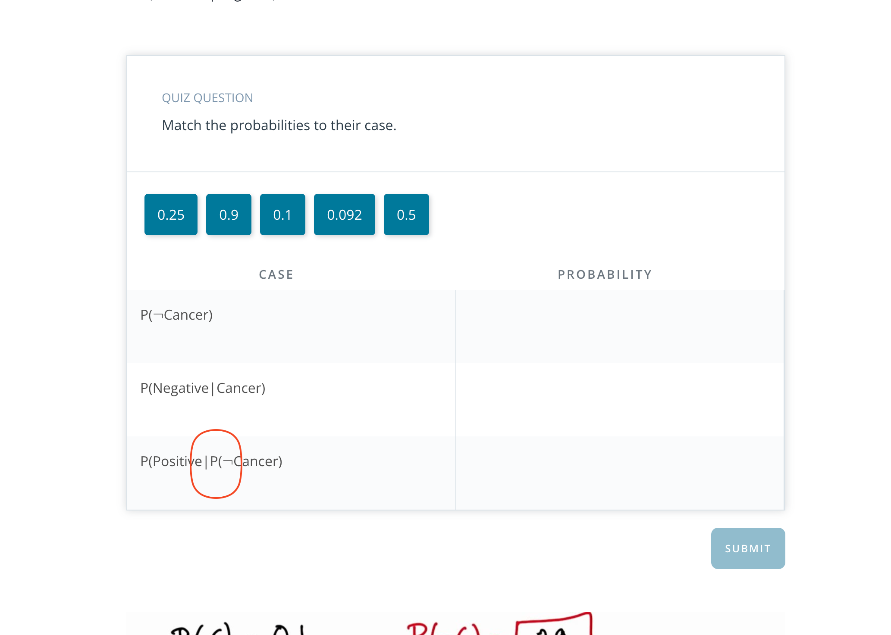

## Issue
**Issue number** _(& page link)_: 347 [`index`==347 and `Course Name`=='Practical Statistics' and `Lesson Name`=='Bayes Rule' and `Page Name`=='Disease Test 1'](https://mocha.udacity.com/programs/nd496-mentors-sandbox/en-us/construction/courses/545f4c46-ae54-4164-897e-4a0bb573302d/lessons/ls12047/pages/a633965b-c86a-4bf3-b0d3-b89cd6a1dac3)
***

**The Issue:**

**Category**: Error in quiz, solution, and/or feedback

**Follow-on**: What error did you encounter?

**Commentary**: Incorrect nomenclature Why is this an error? Extra P( in
P(Positive|P(¬Cancer) should be P(Positive|¬Cancer)

**Comments**: 

***
## Solution

Typo remove second P from P(Positive|P(¬Cancer) 

</img>