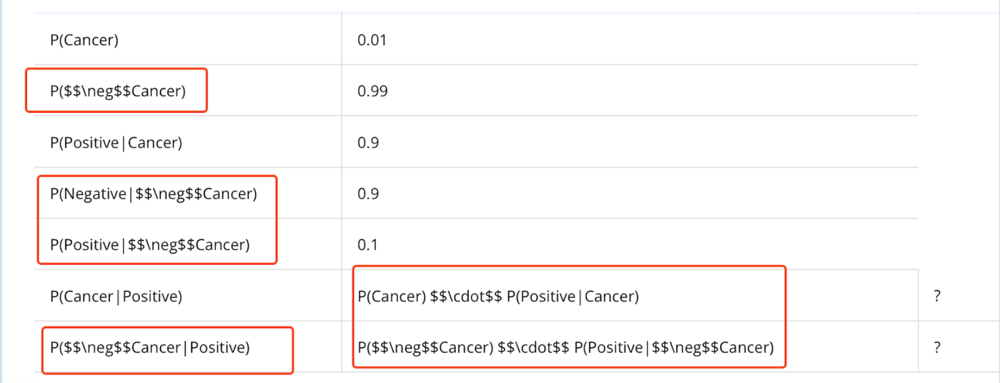

## Issue
**Issue number** _(& page link)_: 350 [`index`==350 and `Course Name`=='Practical Statistics' and `Lesson Name`=='Bayes Rule' and `Page Name`=='Prior And Posterior'](https://mocha.udacity.com/programs/nd496-mentors-sandbox/en-us/construction/courses/545f4c46-ae54-4164-897e-4a0bb573302d/lessons/ls12047/pages/4dfd50d6-56df-4f04-9f83-f7cdb1887883)
***

**The Issue:**

**Category**: Video is confusing

**Follow-on**: Which section of the video is confusing? (e.g. 02:15)

**Commentary**: All of it What do you find confusing? I was presented with a
formula 3 times and each time was told it's incomplete. What is
the actual equation?

**Comments**: 

***
## Solution

Markdown is not correctly formatted. Not an issue in mocha

</img>