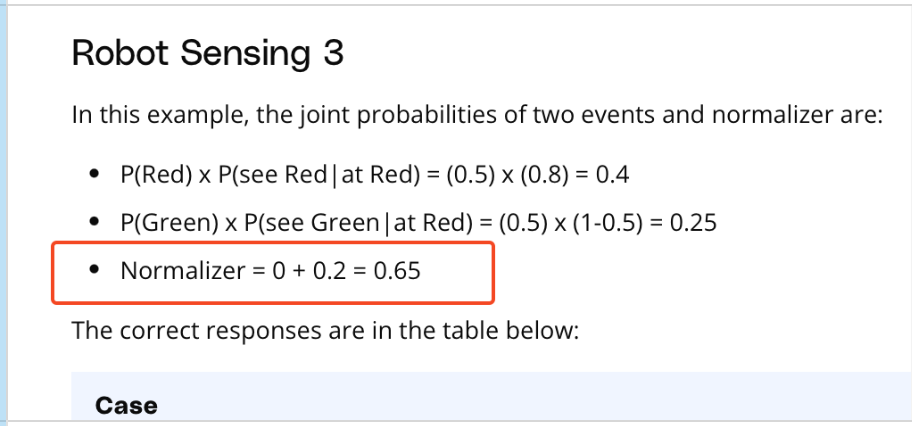

## Issue
**Issue number** _(& page link)_: 356 [`index`==356 and `Course Name`=='Practical Statistics' and `Lesson Name`=='Bayes Rule' and `Page Name`=='Robot Sensing 3'](https://mocha.udacity.com/programs/nd496-mentors-sandbox/en-us/construction/courses/545f4c46-ae54-4164-897e-4a0bb573302d/lessons/ls12047/pages/c7453646-bbba-4d75-a89c-ff0931391450)
***

**The Issue:**

**Category**: Error in content

**Follow-on**: What error did you encounter?

**Commentary**: Normalizer  is not correct How did you know this was an error? 0
+ 0.2 can not be 0.65 Please list any additional resources you
reviewed. It should be 0.4+0.25 = 0.65!

**Comments**: 

***
## Solution

Fix typo: Normalizer should be the sum of the two previous statements 

</img>