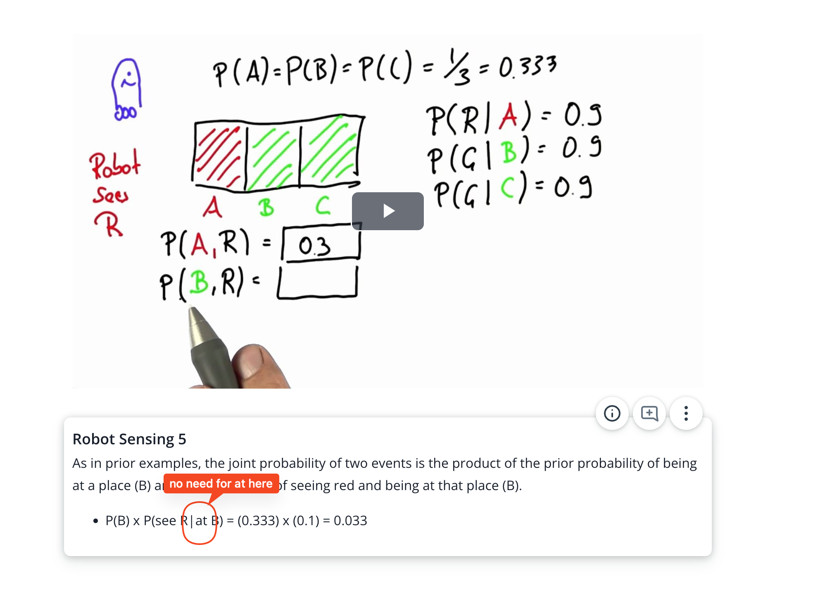

## Issue
**Issue number** _(& page link)_: 359 [`index`==359 and `Course Name`=='Practical Statistics' and `Lesson Name`=='Bayes Rule' and `Page Name`=='Robot Sensing 5'](https://mocha.udacity.com/programs/nd496-mentors-sandbox/en-us/construction/courses/545f4c46-ae54-4164-897e-4a0bb573302d/lessons/ls12047/pages/ca483a78-5f06-4bfa-b658-52605a08f354)
***

**The Issue:**

**Category**: Error in content

**Follow-on**: What error did you encounter?

**Commentary**: As in prior examples, the joint probability of two events is the
product of the prior probability of being at a place (B) and the
probability of seeing red "Given" being at that place (B). And
is used for joint probability yet Given for conditional
probability How did you know this was an error? errata Please
list any additional resources you reviewed.

**Comments**: 

***
## Solution

Remove "at" from expression

</img>