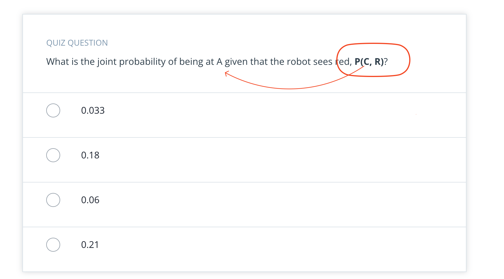

## Issue
**Issue number** _(& page link)_: 366 [`index`==366 and `Course Name`=='Practical Statistics' and `Lesson Name`=='Bayes Rule' and `Page Name`=='Robot Sensing 6'](https://mocha.udacity.com/programs/nd496-mentors-sandbox/en-us/construction/courses/545f4c46-ae54-4164-897e-4a0bb573302d/lessons/ls12047/pages/4f1d95d7-5ca8-4d84-8e78-9f66c4920c37)
***

**The Issue:**

**Category**: Error in quiz, solution, and/or feedback

**Follow-on**: What error did you encounter?

**Commentary**: Typo in question Why is this an error? other part of question
and answer refer to place 'C' BUT beginning of question has
place 'A'

**Comments**: please correct the typo for benefit of future students

***
## Solution

Typo in question, should be P(A,R) (or "being at C")

</img>