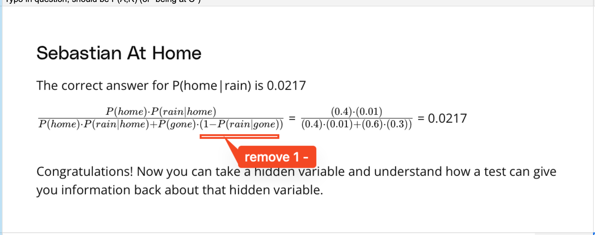

## Issue
**Issue number** _(& page link)_: 371 [`index`==371 and `Course Name`=='Practical Statistics' and `Lesson Name`=='Bayes Rule' and `Page Name`=='Sebastian At Home'](https://mocha.udacity.com/programs/nd496-mentors-sandbox/en-us/construction/courses/545f4c46-ae54-4164-897e-4a0bb573302d/lessons/ls12047/pages/e5b031d1-a1bf-41d3-8b72-32db57ad3ec4)
***

**The Issue:**

**Category**: Error in content

**Follow-on**: What error did you encounter?

**Commentary**: the probability to see rain when he is gone is not reported
correctly. P(rain/gone) was a fact of the exercise no need to do
1-P How did you know this was an error? the data of the exercise
and the result itself shows this Please list any additional
resources you reviewed.

**Comments**: 

***
## Solution

Typo

</img>