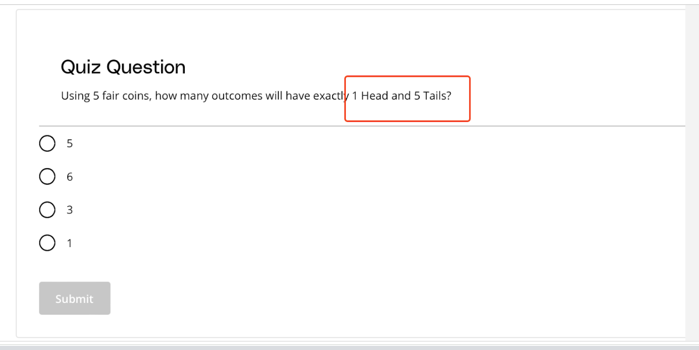

## Issue
**Issue number** _(& page link)_: 374 [`index`==374 and `Course Name`=='Practical Statistics' and `Lesson Name`=='Binomial Distribution' and `Page Name`=='5 Flips 1 Head'](https://mocha.udacity.com/programs/nd496-mentors-sandbox/en-us/construction/courses/545f4c46-ae54-4164-897e-4a0bb573302d/lessons/ls12044/pages/ec854605-fa9c-4e36-b980-af4fcea8e4c1)
***

**The Issue:**

**Category**: Quiz is confusing

**Follow-on**: What do you find confusing?

**Commentary**: 5 Tails What would you find helpful here? It should say 4 Tails
as abov

**Comments**: 

***
## Solution

Typo can't be 5 flips of 1 head and 5 tails

</img>