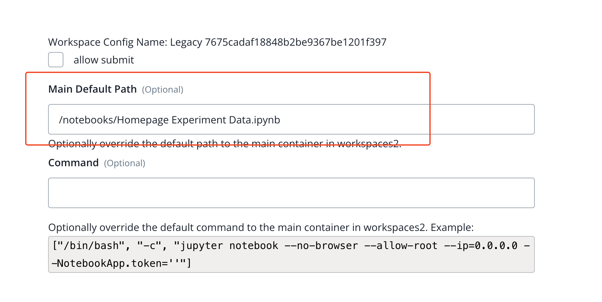

## Issue
**Issue number** _(& page link)_: 387 [`index`==387 and `Course Name`=='Practical Statistics' and `Lesson Name`=='Case Study: A/B tests' and `Page Name`=='Metric - Average Reading Duration'](https://mocha.udacity.com/programs/nd496-mentors-sandbox/en-us/construction/courses/545f4c46-ae54-4164-897e-4a0bb573302d/lessons/ls11579/pages/7abf4ae2-661c-4c48-a8b8-10c02d8c7e8c)
***

**The Issue:**

**Category**: Error in content

**Follow-on**: What is the error?

**Commentary**: homepage experiment data.ipynb is loaded but should be the one
in the video: average reading duration.ipynb What correction
needs to be made? change the ipynb file to the correspnding on

**Comments**: 

***
## Solution

Incorrect notebook is displayed

</img>