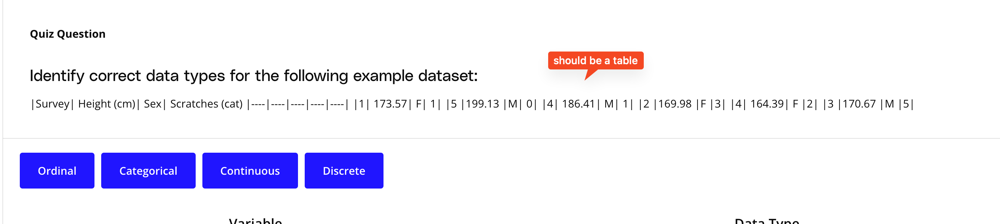

## Issue
**Issue number** _(& page link)_: 40 [`index`==40 and `Course Name`=='Data Visualization with Matplotlib and Seaborn' and `Lesson Name`=='Design of Visualizations' and `Page Name`=='Identifying Data Types'](https://learn.udacity.com/paid-courses/cd12532/lessons/b1b89bfd-19c2-4bc5-9106-6934b22c8efe/concepts/f728a47c-9d07-4a87-aa8f-a33007cc3f4e)
***

**The Issue:**

**Category**: Error in quiz, solution, and/or feedback

**Follow-on**: What error did you encounter?

**Commentary**: Markdown table display error. Why is this an error? Markdown is
displayed as plain text.

**Comments**: 

***
## Solution

Markdown table not formatted (it appears formatted in Mocha)

</img>