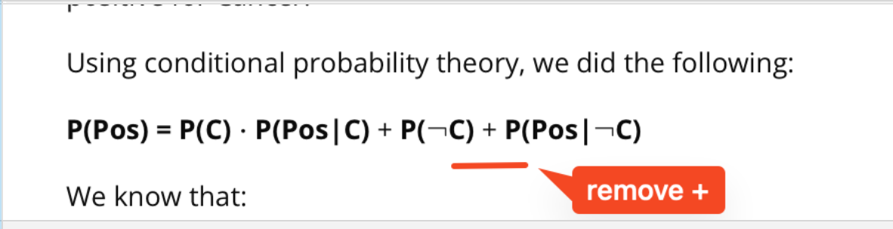

## Issue
**Issue number** _(& page link)_: 402 [`index`==402 and `Course Name`=='Practical Statistics' and `Lesson Name`=='Conditional Probability' and `Page Name`=='Medical Example 1'](https://mocha.udacity.com/programs/nd496-mentors-sandbox/en-us/construction/courses/545f4c46-ae54-4164-897e-4a0bb573302d/lessons/ls11577/pages/a8063b4c-b412-452e-af4b-42fa921997c3)
***

**The Issue:**

**Category**: ntent needs more detail

**Follow-on**: What topic needs more detail?

**Commentary**: I don't know why I have to multiple by the probability of having
cancer. Why can't I just multiple together the probability of
P(Pos|C) * P(Pos|-C)? What additional detail should be included?
I don't know why I have to multiple by the probability of having
cancer. Why can't I just multiple together the probability of
P(Pos|C) * P(Pos|-C)?

**Comments**: 

***
## Solution

Typo

</img>