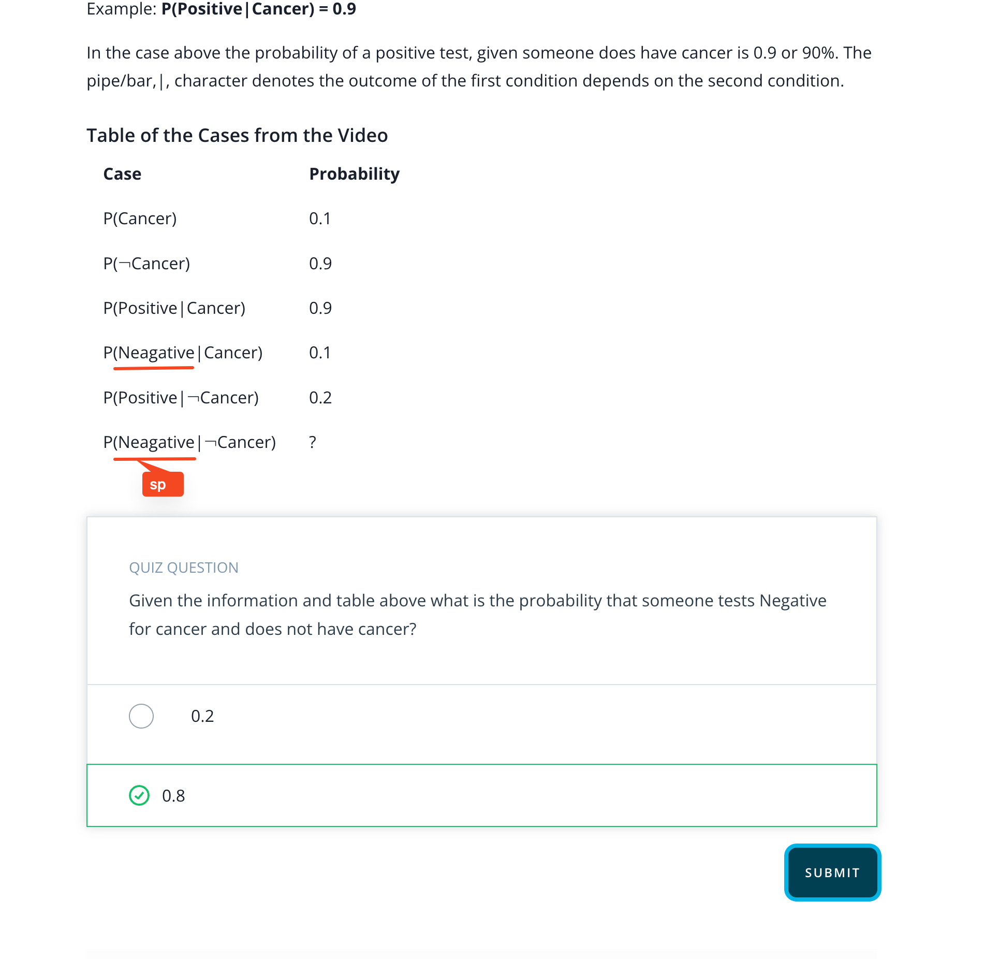

## Issue
**Issue number** _(& page link)_: 410 [`index`==410 and `Course Name`=='Practical Statistics' and `Lesson Name`=='Conditional Probability' and `Page Name`=='Medical Example 2'](https://mocha.udacity.com/programs/nd496-mentors-sandbox/en-us/construction/courses/545f4c46-ae54-4164-897e-4a0bb573302d/lessons/ls11577/pages/abb04dae-d1bf-4c4c-92a1-574e103c2837)
***

**The Issue:**

**Category**: Incorrect answer was accepted

**Follow-on**: What was submitted?

**Commentary**: I submitted 0.8, but the quiz said it was wrong. On the video
the professor says the correct answer is 0.8

**Comments**: 

***
## Solution

fixed on mocha, but there are typos to fix

</img>