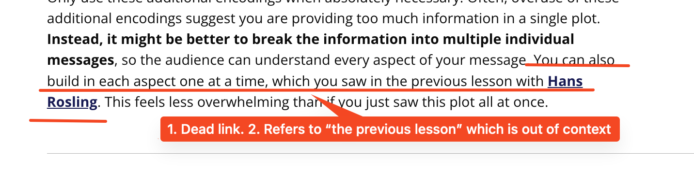

## Issue
**Issue number** _(& page link)_: 42 [`index`==42 and `Course Name`=='Data Visualization with Matplotlib and Seaborn' and `Lesson Name`=='Design of Visualizations' and `Page Name`=='Shape, Size, & Other Tools'](ADD_LINK_HERE)
***

**The Issue:**

**Category**: Resource is missing or broken (link, dataset, etc)

**Follow-on**: What is missing or broken?

**Commentary**: What is the link even supposed to go to?

**Comments**: 

***
## Solution

1. Dead link. 2. Refers to “the previous lesson” which is out of context

</img>