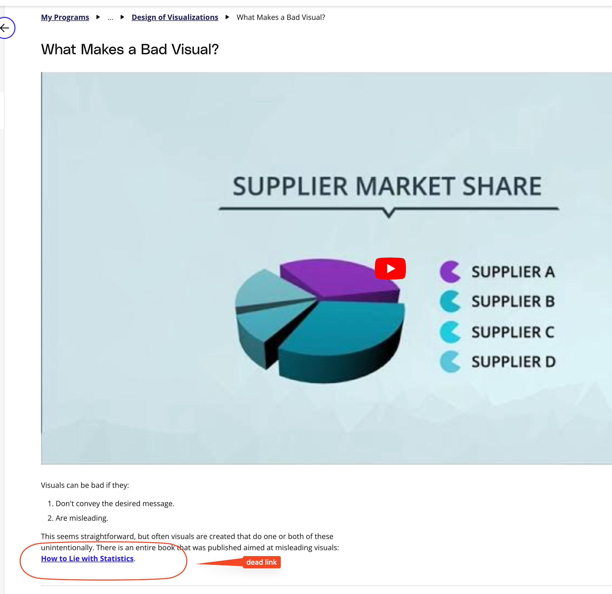

## Issue
**Issue number** _(& page link)_: 43 [`index`==43 and `Course Name`=='Data Visualization with Matplotlib and Seaborn' and `Lesson Name`=='Design of Visualizations' and `Page Name`=='What Makes a Bad Visual?'](https://learn.udacity.com/paid-courses/cd12532/lessons/b1b89bfd-19c2-4bc5-9106-6934b22c8efe/concepts/703162f2-3451-437f-b1ae-faf762f06fbd)
***

**The Issue:**

**Category**: Resource is missing or broken (link, dataset, etc)

**Follow-on**: What is missing or broken?

**Commentary**: The PDF book doesn't load and had errors.

**Comments**: 

***
## Solution

Link is dead:

Alternative link?

https://www.researchgate.net/profile/Grigori-Evreinov/post/Data-visualization-which-is-best-for-within-and-cross-source-data/attachment/5b0690b6b53d2f63c3cdcad5/AS%3A629755908993031%401527156917765/download/How-to-Lie-with-Statistics.pdf

</img>