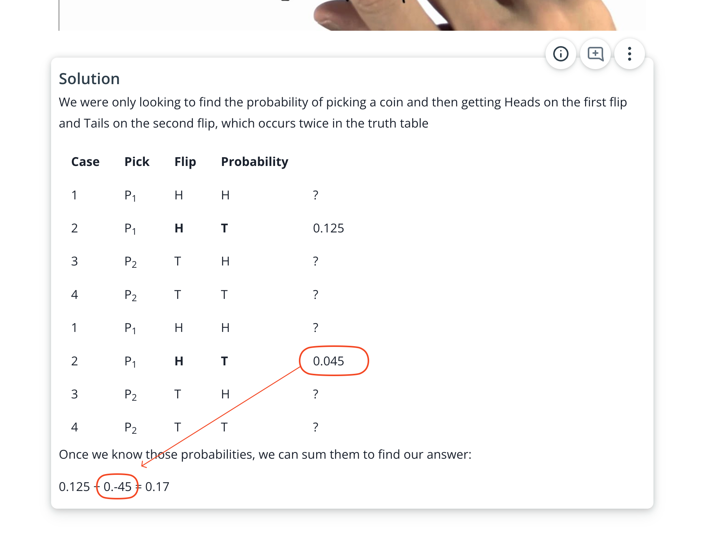

## Issue
**Issue number** _(& page link)_: 474 [`index`==474 and `Course Name`=='Practical Statistics' and `Lesson Name`=='Conditional Probability' and `Page Name`=='Two Coins 3'](https://mocha.udacity.com/programs/nd496-mentors-sandbox/en-us/construction/courses/545f4c46-ae54-4164-897e-4a0bb573302d/lessons/ls11577/pages/7fbb1484-405e-4cbb-9e6f-512739271a44)
***

**The Issue:**

**Category**: Error in content

**Follow-on**: What error did you encounter?

**Commentary**: In answer should be 0.125+0.045=0.17 How did you know this was
an error? Is "-", should be "0" Please list any additional
resources you reviewed.

**Comments**: 

***
## Solution

Typo

</img>