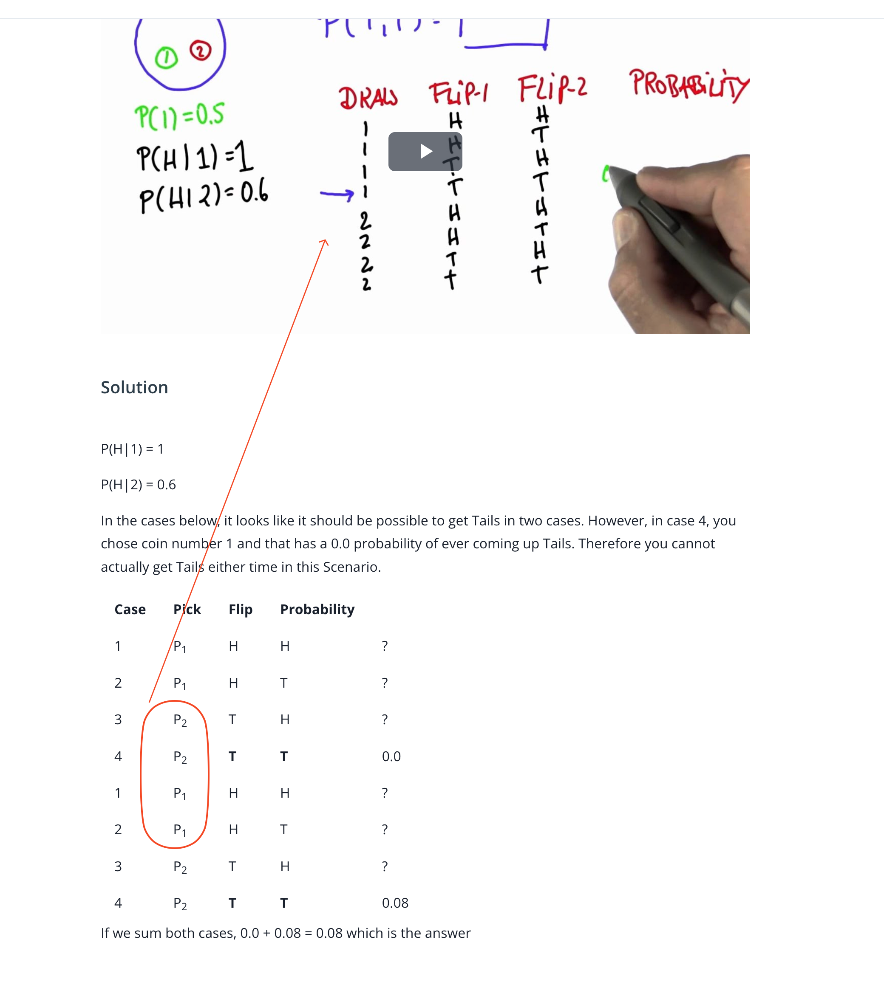

## Issue
**Issue number** _(& page link)_: 482 [`index`==482 and `Course Name`=='Practical Statistics' and `Lesson Name`=='Conditional Probability' and `Page Name`=='Two Coins 4'](https://mocha.udacity.com/programs/nd496-mentors-sandbox/en-us/construction/courses/545f4c46-ae54-4164-897e-4a0bb573302d/lessons/ls11577/pages/76a2e3cb-958e-4c44-9b1d-9caca4933448)
***

**The Issue:**

**Category**: Error in content

**Follow-on**: What error did you encounter?

**Commentary**: The truth table is wrong. How did you know this was an error?
Pick 1 only has flip possibilities of H,H & H,T Pick 2 only has
flip possibilities of T,H & T,T The correct truth table is
literally in the videos. Please list any additional resources
you reviewed. Same with the truth table at the bottom of the
page.

**Comments**: 

***
## Solution

Typo in truth table
</img>