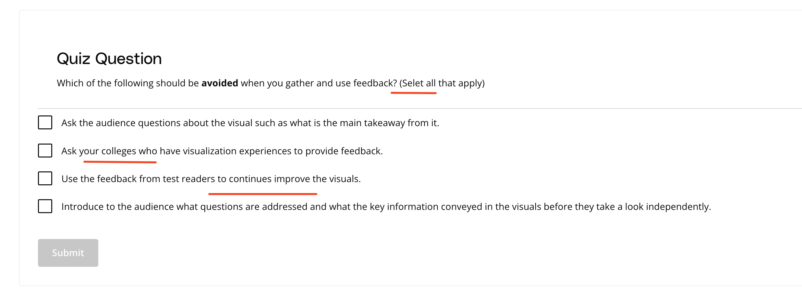

## Issue
**Issue number** _(& page link)_: 49 [`index`==49 and `Course Name`=='Data Visualization with Matplotlib and Seaborn' and `Lesson Name`=='Explanatory Visualizations' and `Page Name`=='Getting and Using Feedback'](https://learn.udacity.com/paid-courses/cd12532/lessons/0611e065-bed4-41b1-8e1c-52e7f44dbec6/concepts/3da2defd-f267-44ea-ae98-cb6cebeab00a)
***

**The Issue:**

**Category**: Quiz is confusing

**Follow-on**: What do you find confusing?

**Commentary**: All of these choices look like options to be used. What would
you find helpful here? Spell-checking it, for one thing.

**Comments**: 

***
## Solution

Fix typos, clarify english used

Completed in Mocha

</img>