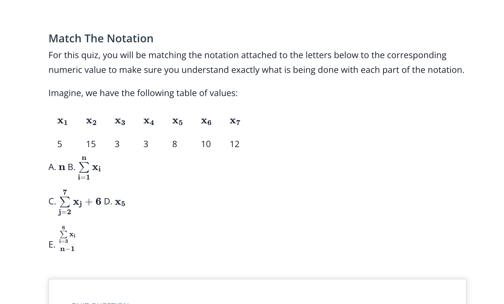

## Issue
**Issue number** _(& page link)_: 493 [`index`==493 and `Course Name`=='Practical Statistics' and `Lesson Name`=='Descriptive Statistics - Part I' and `Page Name`=='Quiz: Summation'](https://mocha.udacity.com/programs/nd496-mentors-sandbox/en-us/construction/courses/545f4c46-ae54-4164-897e-4a0bb573302d/lessons/ls0220/pages/f46aa0dd-ad07-4b53-b6ee-c93d958510d2)
***

**The Issue:**

**Category**: Resource is missing or broken (link, dataset, etc)

**Follow-on**: What is missing or broken?

**Commentary**: the column name's format is broken. This is shown on Edge: $$
\bold{x_1}$$ $$ \bold{x_2}$$

**Comments**: 

***
## Solution

Fixed on Mocha

</img>