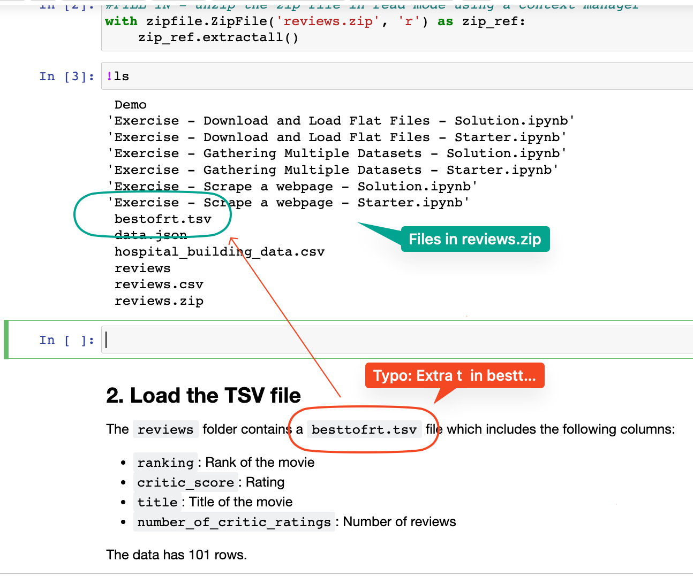

## Issue
**Issue number** _(& page link)_: 5 [`index`==5 and `Course Name`=='Advanced Data Wrangling' and `Lesson Name`=='Gathering Data' and `Page Name`=='Exercise: Download and Load Flat Files'](https://learn.udacity.com/nanodegrees/nd002/parts/cd12531/lessons/0da07272-e348-4064-995d-344d00974630/concepts/b7264700-6744-4457-a80e-5d1fde3bac0a)
***

**The Issue:**

**Category**: Loading problems

**Follow-on**: 

**Commentary**: 

**Comments**: The `reviews` folder contains a `besttofrt.tsv` file which
includes the following columns:  the file name is bestofrt not
besttofrt is double tt in it.

***
## Solution

- Change `besttofrt.tsv` to `bestofrt.tsv` in **Section 2**

  (Notebook issue, so cannot change in Mocha)
  
***

</img>