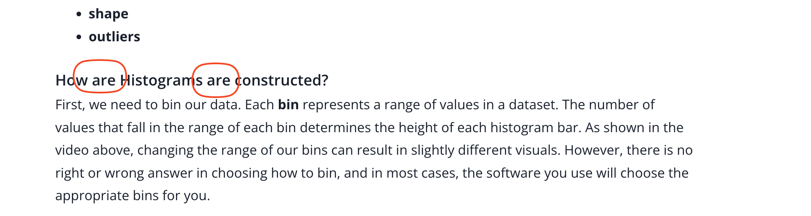

## Issue
**Issue number** _(& page link)_: 502 [`index`==502 and `Course Name`=='Practical Statistics' and `Lesson Name`=='Descriptive Statistics - Part II' and `Page Name`=='Histograms'](https://mocha.udacity.com/programs/nd496-mentors-sandbox/en-us/construction/courses/545f4c46-ae54-4164-897e-4a0bb573302d/lessons/ls0221/pages/5bf9e684-3b29-40c8-8fb7-05356cfc84a0)
***

**The Issue:**

**Category**: Error in content

**Follow-on**: What error did you encounter?

**Commentary**: GRAMMER How did you know this was an error? IDK YOU READ THIS
AND TELL ME :How are Histograms are constructed? Please list any
additional resources you reviewed.

**Comments**: 

***
## Solution

Typo 

</img>