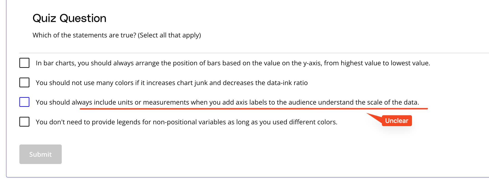

## Issue
**Issue number** _(& page link)_: 51 [`index`==51 and `Course Name`=='Data Visualization with Matplotlib and Seaborn' and `Lesson Name`=='Explanatory Visualizations' and `Page Name`=='Polishing Plots Quiz'](https://learn.udacity.com/paid-courses/cd12532/lessons/0611e065-bed4-41b1-8e1c-52e7f44dbec6/concepts/08ad4df2-93c9-4e5d-a8be-811fc069b346)
***

**The Issue:**

**Category**: Other

**Follow-on**: Can you tell us more?

**Commentary**: 

**Comments**: 3rd solution not worded correctly:  "You should always include
units or measurements when you add axis labels to the audience
understand the scale of the data".

***
## Solution

The 3rd response is not clear.

Fixed on Mocha

</img>