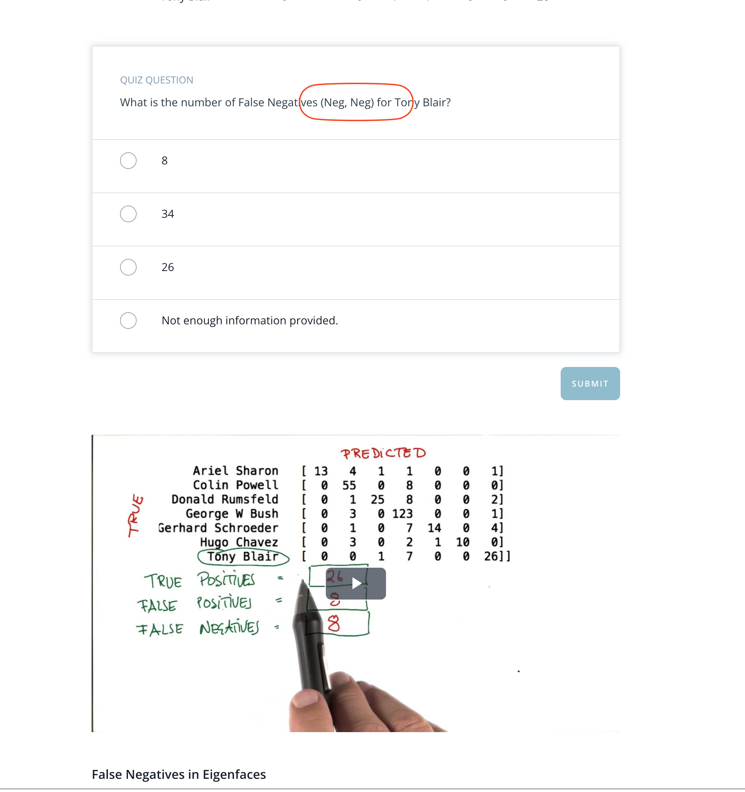

## Issue
**Issue number** _(& page link)_: 539 [`index`==539 and `Course Name`=='Practical Statistics' and `Lesson Name`=='Logistic Regression' and `Page Name`=='False Negatives in Eigenfaces'](https://mocha.udacity.com/programs/nd496-mentors-sandbox/en-us/construction/courses/545f4c46-ae54-4164-897e-4a0bb573302d/lessons/ls12054/pages/39fb32d8-30e5-48cc-8c96-942a8e9b836c)
***

**The Issue:**

**Category**: Error in quiz, solution, and/or feedback

**Follow-on**: What error did you encounter?

**Commentary**: What is the number of False Negatives (Neg, Neg) for Tony Blair?
Why is this an error? False Negatives should be (Pos, Neg)

**Comments**: 

***
## Solution

Typo in quiz. 

</img>