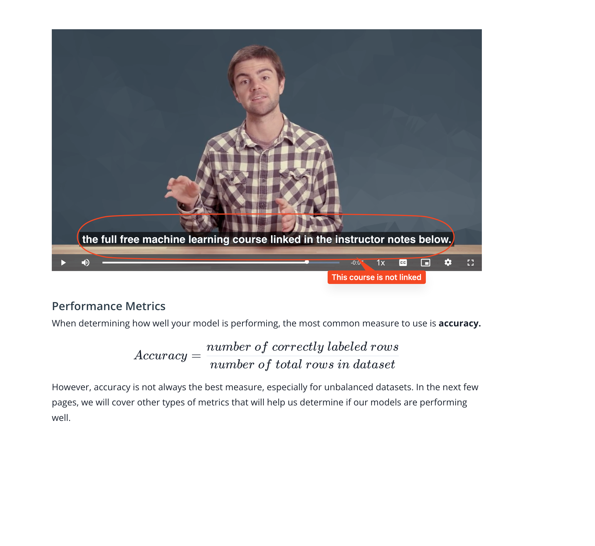

## Issue
**Issue number** _(& page link)_: 540 [`index`==540 and `Course Name`=='Practical Statistics' and `Lesson Name`=='Logistic Regression' and `Page Name`=='Model Diagnostics + Performance Metrics'](https://mocha.udacity.com/programs/nd496-mentors-sandbox/en-us/construction/courses/545f4c46-ae54-4164-897e-4a0bb573302d/lessons/ls12054/pages/abb2a62a-56b9-49b6-9f07-c12f58a9996f)
***

**The Issue:**

**Category**: Resource is missing or broken (link, dataset, etc)

**Follow-on**: What is missing or broken?

**Commentary**: In the video there is a machine learning course linked in the
notes below but in the notes is not.

**Comments**: 

***
## Solution

Free course mentioned in video is not linked in page.

</img>