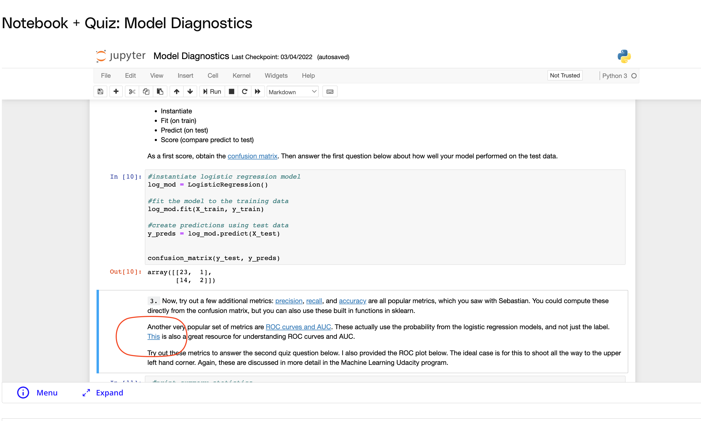

## Issue
**Issue number** _(& page link)_: 546 [`index`==546 and `Course Name`=='Practical Statistics' and `Lesson Name`=='Logistic Regression' and `Page Name`=='Quiz: Model Diagnostics'](https://mocha.udacity.com/programs/nd496-mentors-sandbox/en-us/construction/courses/545f4c46-ae54-4164-897e-4a0bb573302d/lessons/ls12054/pages/384d9464-3388-4da8-a500-0734570944ee)
***

**The Issue:**

**Category**: Other

**Follow-on**: Can you tell us more?

**Commentary**: 

**Comments**: There is a broken link on number 3. "This" is broken.

***
## Solution

Broken link in notebook

</img>