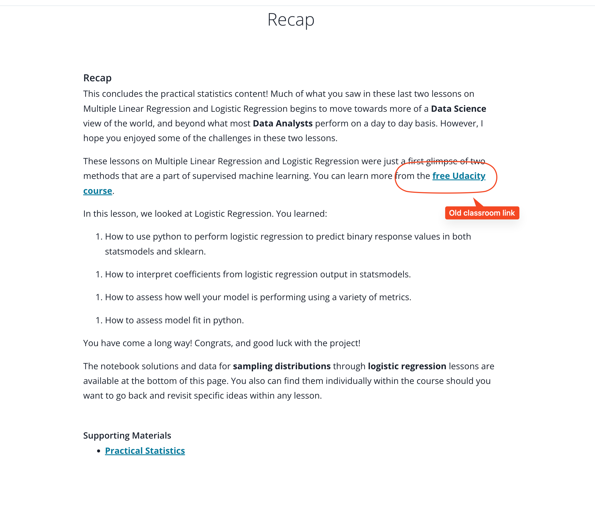

## Issue
**Issue number** _(& page link)_: 550 [`index`==550 and `Course Name`=='Practical Statistics' and `Lesson Name`=='Logistic Regression' and `Page Name`=='Recap'](https://mocha.udacity.com/programs/nd496-mentors-sandbox/en-us/construction/courses/545f4c46-ae54-4164-897e-4a0bb573302d/lessons/ls12054/pages/912f893b-0baf-40d3-a55e-41be50f8d6f5)
***

**The Issue:**

**Category**: Other

**Follow-on**: Can you tell us more?

**Commentary**: 

**Comments**: no content on this page

***
## Solution

Update link from old classroom link

</img>