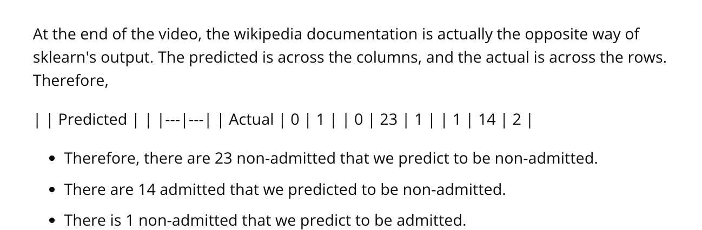

## Issue
**Issue number** _(& page link)_: 553 [`index`==553 and `Course Name`=='Practical Statistics' and `Lesson Name`=='Logistic Regression' and `Page Name`=='Walkthrough: Model Diagnostics in Python - Part I'](https://mocha.udacity.com/programs/nd496-mentors-sandbox/en-us/construction/courses/545f4c46-ae54-4164-897e-4a0bb573302d/lessons/ls12054/pages/5ed123a9-a27c-4f37-a45a-21caadefca28)
***

**The Issue:**

**Category**: Video is lacking details

**Follow-on**: What detail is missing?

**Commentary**: confusion matrix should have lables

**Comments**: 

***
## Solution

Fixed in mocha

</img>