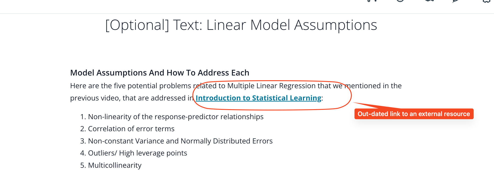

## Issue
**Issue number** _(& page link)_: 557 [`index`==557 and `Course Name`=='Practical Statistics' and `Lesson Name`=='Multiple Linear Regression' and `Page Name`=='[Optional] Text: Linear Model Assumptions'](https://mocha.udacity.com/programs/nd496-mentors-sandbox/en-us/construction/courses/545f4c46-ae54-4164-897e-4a0bb573302d/lessons/ls12053/pages/3ec7eb1d-b6d3-41f5-8d23-50fb5b04db52)
***

**The Issue:**

**Category**: ntent contains outdated information

**Follow-on**: Which specific piece of text on this page is out-of-date?

**Commentary**: The Introduction to Statistical Learning link no longer works.
Error 404. What text would you replace this with? Include any
links that will be helpful. A link to the text that works.

**Comments**: 

***
## Solution

Update outdated link

</img>