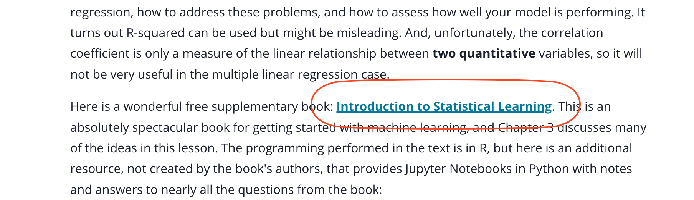

## Issue
**Issue number** _(& page link)_: 558 [`index`==558 and `Course Name`=='Practical Statistics' and `Lesson Name`=='Multiple Linear Regression' and `Page Name`=='Introduction'](https://mocha.udacity.com/programs/nd496-mentors-sandbox/en-us/construction/courses/545f4c46-ae54-4164-897e-4a0bb573302d/lessons/ls12053/pages/aac1161d-84df-4eec-9773-1384e9aae5bb)
***

**The Issue:**

**Category**: Resource is missing or broken (link, dataset, etc)

**Follow-on**: What is missing or broken?

**Commentary**: Link to ebook "Introduction to Statistical Learning" does not
exist anymore.

**Comments**: 

***
## Solution

broken link

</img>