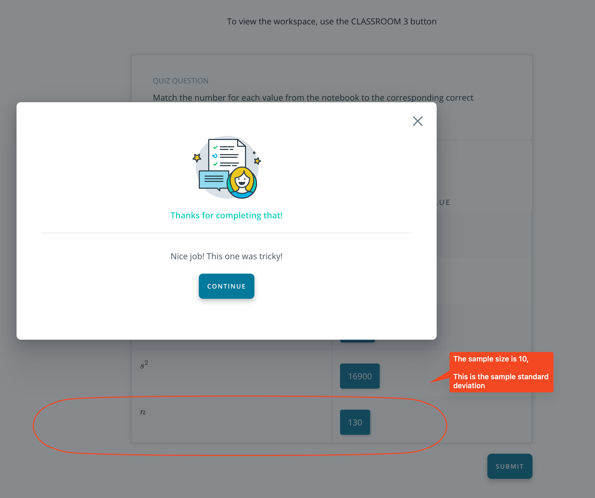

## Issue
**Issue number** _(& page link)_: 611 [`index`==611 and `Course Name`=='Practical Statistics' and `Lesson Name`=='Sampling distributions and the Central Limit Theorem' and `Page Name`=='Quiz: Notation'](ADD_LINK_HERE)
***

**The Issue:**

**Category**: Quiz is confusing

**Follow-on**: What do you find confusing?

**Commentary**: Why have n in the table. I thought it must be 's' What would you
find helpful here? chan

**Comments**: 

***
## Solution

</img>