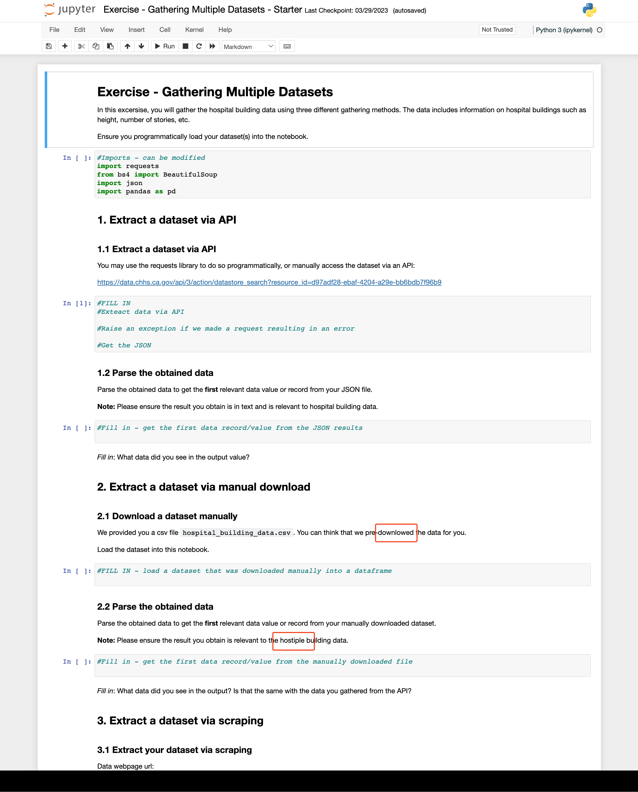

## Issue
**Issue number** _(& page link)_: 7 [`index`==7 and `Course Name`=='Advanced Data Wrangling' and `Lesson Name`=='Gathering Data' and `Page Name`=='Final Exercise: Gathering Multiple Datasets'](https://learn.udacity.com/nanodegrees/nd002/parts/cd12531/lessons/0da07272-e348-4064-995d-344d00974630/concepts/05517c6a-f4a9-40e5-bf8e-856eda67d195)
***

**The Issue:**

**Category**: Other

**Follow-on**: Can you tell us more?

**Commentary**: 

**Comments**: Note: Please ensure the result you obtain is in text (not with
HTML tags) and is relevant to the hospital buidling data. Hint:
you can use the find_all() methood with tags like
d:buildingname, d:buildingcode, etc.  Methood in the text should
be method

***
## Solution

</img>