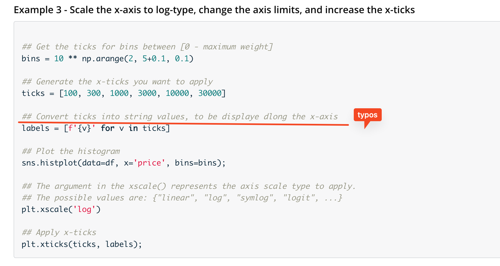

## Issue
**Issue number** _(& page link)_: 73 [`index`==73 and `Course Name`=='Data Visualization with Matplotlib and Seaborn' and `Lesson Name`=='Univariate Exploration of Data' and `Page Name`=='Scales and Transformations'](https://learn.udacity.com/paid-courses/cd12532/lessons/14fea937-4be6-4308-9925-b69bb1f041f5/concepts/0e84f602-f890-4eb7-8ce4-6c34a56f6edc)
***

**The Issue:**

**Category**: Error in content

**Follow-on**: What error did you encounter?

**Commentary**: Just an error in the comment. How did you know this was an
error? "Convert ticks into string values, to be displaye dlong
the x-axis." should be rewritten as "Convert ticks into string
values, to be displayed along the x-axis."  Please list any
additional resources you reviewed.

**Comments**: 

***
## Solution

updated code comment ("to be displayed along the x-axis" )

fixed in mocha

</img>