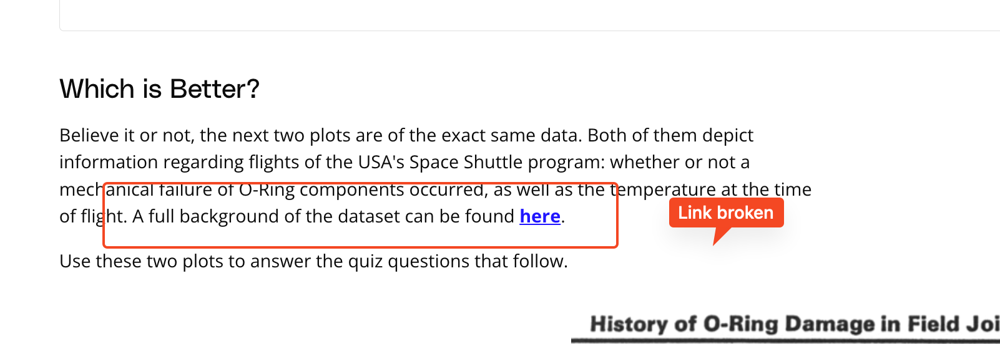

## Issue
**Issue number** _(& page link)_: 81 [`index`==81 and `Course Name`=='Data Visualization with Matplotlib and Seaborn' and `Lesson Name`=='Design of Visualizations' and `Page Name`=='Practice: Chart Junk and Integrity'](https://learn.udacity.com/paid-courses/cd12532/lessons/b1b89bfd-19c2-4bc5-9106-6934b22c8efe/concepts/a91cba15-cd8d-4497-8f97-27082a649fc7)
***

**The Issue:**

**Category**: Resource is missing or broken (link, dataset, etc)

**Follow-on**: What is missing or broken?

**Commentary**: Link for dataset background is broken

**Comments**: 

***
## Solution

Fix link

Seems to be the correct on, check: https://archive.ics.uci.edu/dataset/92/challenger+usa+space+shuttle+o+ring

</img>