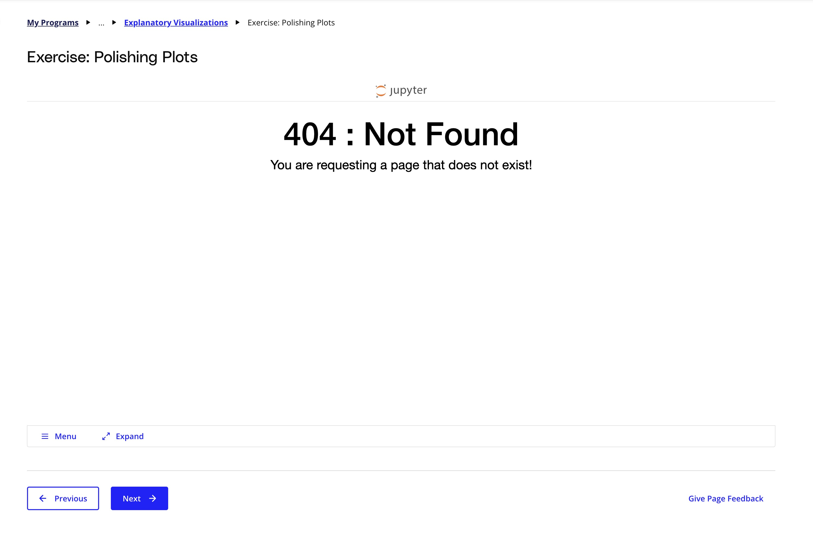

## Issue
**Issue number** _(& page link)_: 82 [`index`==82 and `Course Name`=='Data Visualization with Matplotlib and Seaborn' and `Lesson Name`=='Design of Visualizations' and `Page Name`=='What Makes a Bad Visual?'](https://learn.udacity.com/paid-courses/cd12532/lessons/0611e065-bed4-41b1-8e1c-52e7f44dbec6/concepts/0923843f-6f65-4914-9a73-c5c7c43c51ea)
***

**The Issue:**

**Category**: Resource is missing or broken (link, dataset, etc)

**Follow-on**: What is missing or broken?

**Commentary**: link is broken

**Comments**: 

***
## Solution

Fix notebook

</img>