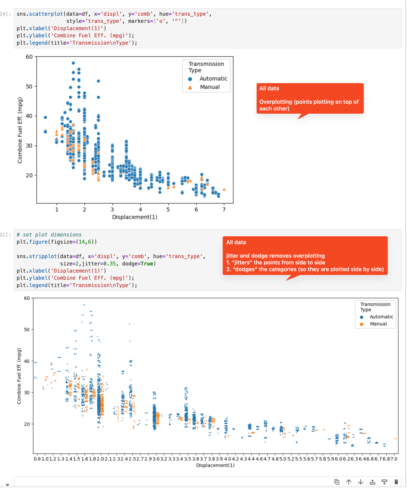

# Potential Rubric Issues

In my experience, rubric items that repeatedly fail are due to (in order):

1. The reviewers do not interpret the rubric item correctly.
2. The rubric item is not clear
3. The lessons do not help complete the rubric item

***

There tends to be uniformity in reviews _(reviewers review in similar ways)_. So, the issue that: _The reviewers do not interpret the rubric item correctly._ is, I believe, due reviewers "learning from each other".

This makes this easy to resolve - if non-productive learned behavior is noticed in reviews, a simple email to all reviewers, pointing out the issue, for that project will stop reviewers repeating that behavior.

***

## _**1. The reviewers do not interpret the rubric item correctly.**_

#### Example: Practical Statistics Rubric Issues

The two most commonly failed rubric items for this project are:

  - All results from different analyses are correctly interpreted. **(Interpretation Rubric)**
  - Correct Values for All Statistical Results
For all numeric values, you should provide the correct results of the analysis.  **(Results Rubric)**

_In parentheses, I have offered shorted explanations of each rubric item_.

If you take a random sample of projects that fail those rubric items, **most** of those reviews will **fail both** of these rubric items _for the same reason_: Because of **incorrect _results_**.

- That is, the reviewers do not clearly delineate between the aims of each rubric item: _interpretation_ & _results_.

#### Example

This is [a detailed review](https://review.udacity.com/#!/reviews/4149326) where the reviewer obviously invested quite a lot of time when completing the linked review.

However, **results** are evaluated in both rubric items.

_Interpretation Rubric:_

_Results Rubric:_

***

## _**2. The rubric item is not clear.**_

#### Example: Investigate a Dataset

_As well as an example of vague rubric items, this is also an example of "learned behavior" by reviewers._

In the screehshot below, two rubric requirements are highlighted:

- One is vague (it is not a strict reequirement)
- That vague requirement has led reviewers to fail **a different** rubric requirement.

***

_Conclusion Requirement:_ If the conclusion does not contain a Limitation section (including heading), many reviewers will fail a student.

- However, the requirement is just that a limitation is included in the conclusion.

_Commentary Requirement:_ The first part is vague, and I can’t remember any reviewers failing a student for not meeting it. However, this is the only requirement that mentions a “Limitation Section” (that some reviewers require in the conclusion rubric item)

***

## _**3. The lessons do not help complete the rubric item.**_

#### Example: Communicate Data

For the plots rubric requirement, there is this important tip:

**Overplotting** is where parts of visualizations plot on top of each other (most commonly refers to scatterplot points plotting on top of each other).

However, the first example in the **Multivariate** plots section:

1. Uses a **sample** of data to avoid **overcrowding** (i.e. overplotting). This is not appropriate.
  - Samples of data should only be used if the dataset is very large.
  - There are appropriate tools for avoiding overplotting.
2. Has multiple typos (the dataframe names change randomly).
3. Uses complicated loops, which can be avoided using plot options _(which should be the aim of the course)_

***

_Sample & Typos:_

***

_Alternative (less code, introduces commonly used plot options):_

***

_Finally, the appropriate way to handle overplotting (jitter & dodge):_

***
